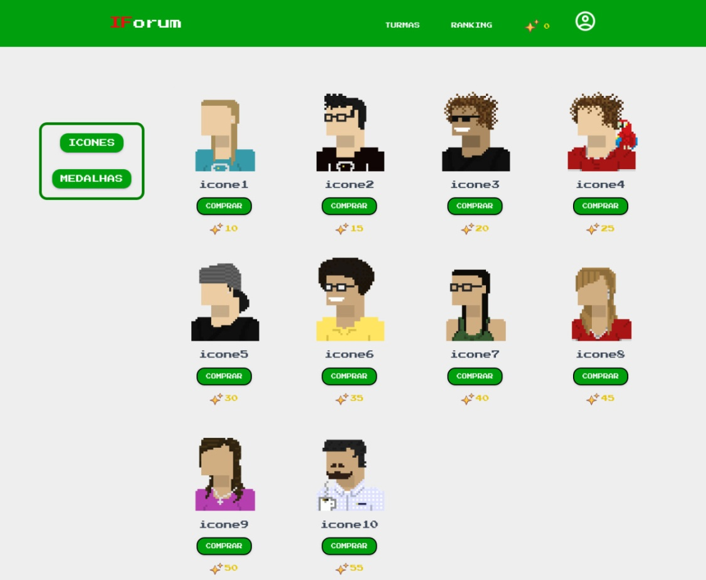

<h1 align="center">IFORUM</h1>

O projeto se trata de um fórum integrado com o SUAP(Principal sistema para gestão dos processos administrativos do IFRN) do IFRN(Instituto Federal de Educação, Ciência e Tecnologia do Rio Grande do Norte), onde o professor cria salas de aula e convida participantes para as mesmas, isso tudo baseado em seus diários que estão no SUAP. 

<h1 align="center">
    <a href="https://laravel.com/">🔗 Laravel</a>
</h1>

Framework utilizado no projeto para desenvolver o projeto

<h1 align="center">
    <a href="https://getbootstrap.com/">🔗 Bootstrap</a>
</h1>

Framework utilizado no projeto para fazer sua estilização e aplicar sua responsividade

<h4 align="center"> 
	✅ IFORUM  Concluido ✅
</h4>

 O projeto já foi concluido. Esse projeto não será continuado pelo motivo de eu não ter mais vínculo com a instituição, sendo assim fico impossíbilitado de fazer alguns testes que precisaria de logins de professores 

### Features

- [x] Cadastro de usuário
- [x] Cadastro de salas se aula
- [x] Compra de itens
- [x] Utilização de itens comprados
- [x] Postagem de perguntas nas salas de aula
- [x] Postagem de respostas nas perguntas feitas nas salas de aula
- [x] Postagem de comentários nas respostas de usuários
- [x] Moderação das salas de aula 

## Screenshots

 Aqui é onde o professor seleciona o diário de classe que consta no suap, para assim criar a sala de aula com os alunos 

<h1 align="center">
  
</h1>

 Aqui é onde o usuário poderá equipar e visualizar os íncones que ele adquiriu na loja 

<h1 align="center">
  
</h1>

 Aqui é onde o usuário poderá equipar e visualizar os íncones que ele adquiriu na loja 

<h1 align="center">
  
</h1>
