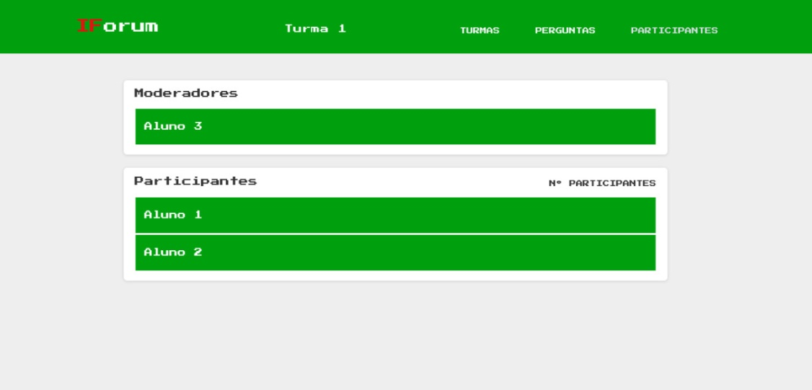
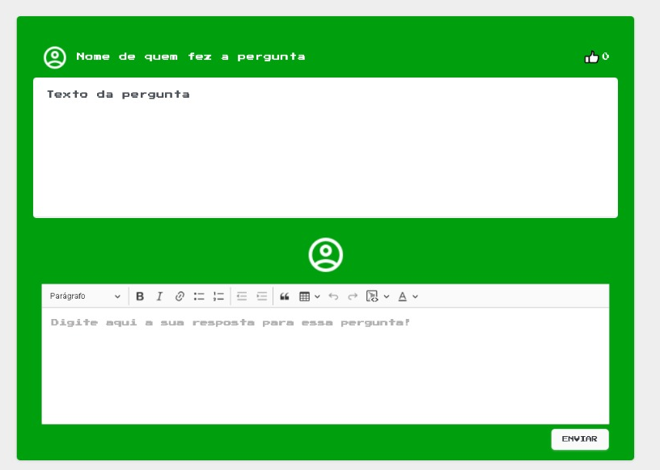
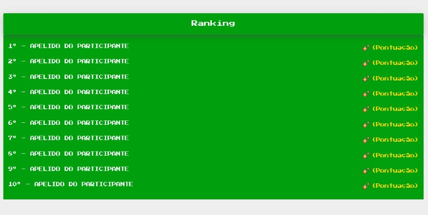
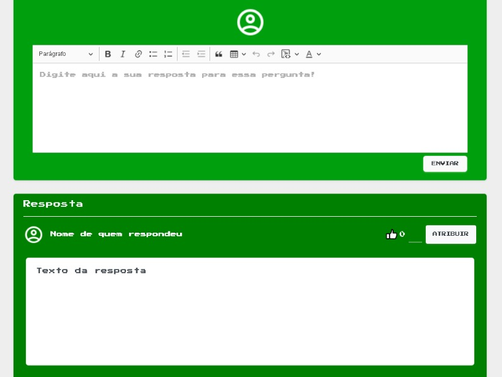

<h1 align="center">IFORUM</h1>

<p align="center">O projeto se trata de um fórum integrado com o SUAP(Principal sistema para gestão dos processos administrativos do IFRN) do IFRN(Instituto Federal de Educação, Ciência e Tecnologia do Rio Grande do Norte), onde o professor cria salas de aula e convida participantes para as mesmas, isso tudo baseado em seus diários que estão no SUAP. </p>
<h1 align="center">
    <a href="https://laravel.com/">🔗 Laravel</a>
</h1>
<p align="center">Framework utilizado no projeto para desenvolver o projeto</p>
<h1 align="center">
    <a href="https://getbootstrap.com/">🔗 Bootstrap</a>
</h1>
<p align="center">Framework utilizado no projeto para fazer sua estilização e aplicar sua responsividade</p>

<h4 align="center"> 
	✅ IFORUM  Concluido ✅
</h4>
<p align="center"> O projeto já foi concluido. Esse projeto não será continuado pelo motivo de eu não ter mais vínculo com a instituição, sendo assim fico impossíbilitado de fazer alguns testes que precisaria de logins de professores </p>

### Features

- [x] Cadastro de usuário
- [x] Cadastro de salas se aula
- [x] Compra de itens
- [x] Utilização de itens comprados
- [x] Postagem de perguntas nas salas de aula
- [x] Postagem de respostas nas perguntas feitas nas salas de aula
- [x] Postagem de comentários nas respostas de usuários
- [x] Moderação das salas de aula 

## Screenshots
<p align="center"> Aqui é onde o professor seleciona o diário de classe que consta no suap, para assim criar a sala de aula com os alunos </p>
<h1 align="center">
  
</h1>

<p align="center"> Aqui é onde o usuário poderá equipar e visualizar os ícones que ele adquiriu na loja </p>
<h1 align="center">
  
</h1>

<p align="center"> Aqui é onde o usuário poderá comprar os itens </p>
<h1 align="center">
  
</h1>

<p align="center"> Aqui é onde o professor poderá visualizar, atribuir, e remover participantes da sala de aula</p>
<h1 align="center">
  
</h1>

<p align="center"> Aqui é como fica a pergunta dos usuários que foram feitas, e é aqui também onde você pode escrever sua resposta</p>
<h1 align="center">
  
</h1>

<p align="center"> Aqui é o ranking da aplicação, onde são rankeados os 10 com melhor pontuação</p>
<h1 align="center">
  
</h1>

<p align="center"> Aqui é como fica organizado as respostas</p>
<h1 align="center">
  
</h1>


### Pré-requisitos

Antes de começar, você vai precisar ter instalado em sua máquina as seguintes ferramentas:
[Git](https://git-scm.com), [Composer](https://getcomposer.org/), [MySql](https://www.mysql.com/), [PHP](https://www.php.net/). 
Além disto é bom ter um editor para trabalhar com o código como [VSCode](https://code.visualstudio.com/)

### 🎲 Rodando o Back End (servidor)

```bash
# Acesse o MySQL no terminal/cmd
$ mysql -u <seu usuario> -p

# Crie um banco de dados para ser utilizado 
mysql> create database "nome do banco de dados sem as aspas";

# Saia do interpretador SQL
mysql> exit

# Clone este repositório
$ git clone https://github.com/andr-vini/IFORUM-TCC.git

# Acesse a pasta do projeto no terminal/cmd
$ cd IFORUM-TCC

# Renomeie o arquivo .env.example para .env
$ cp .env.example .env
```
Abra o arquivo e edite as seguintes variáveis:  
DB_DATABASE=(nome do banco de dados que você criou)  
DB_USERNAME=(seu usuário do mysql)  
DB_PASSWORD=(sua senha do mysql)

```bash
# Instale as dependencias com o composer
$ php composer update
# ou 
$ php (path para o arquivo composer.phar) update

# Execute as migrations para o banco de dados
$ php artisan migrate --seed
```
